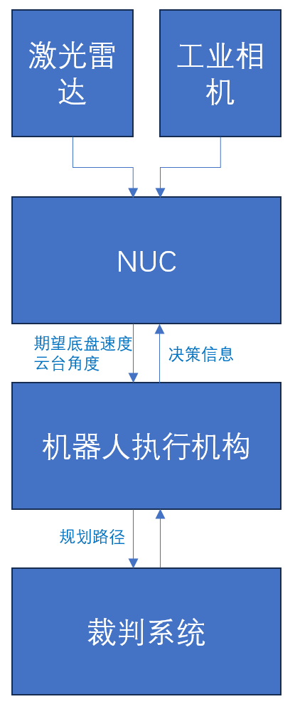
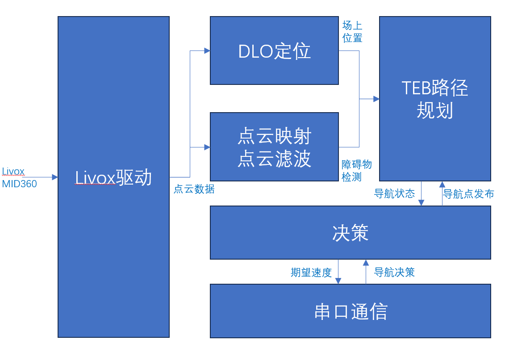

# 华中科技大学ROBOMASTER 2023赛季 哨兵导航算法开源

## 代码结构
```
├── ALL_SLAM.sh							//一键自启动脚本
├── pointlio							
│   └── src
│       ├── CMakeLists.txt
│       ├── livox_ros_driver			 //livox驱动
│       └── Point-LIO					//pointlio建图算法
├── README.md
├── SLAM_2d							   //依托于ROS1的导航和通信worksapce	
│   └── src
│       ├── auto_navigation				//TEB导航包
│       ├── CMakeLists.txt
│       ├── gmcl
│       ├── laser_filters-noetic-devel	 //点云滤波包	
│       ├── pointcloud_to_laserscan		 //3d点云映射包
│       ├── rm_bringup					
│       ├── rm_usart					//串口通信以及决策
│       └── rplidar_ros					
└── SLAM_3d
    ├── DLO							   //DLO激光里程计	
    │   └── src
    ├── Livox-SDK2
    │   ├── 3rdparty
    │   ├── build
    │   ├── CHANGELOG.md
    │   ├── CMakeLists.txt
    │   ├── include
    │   ├── LICENSE.txt
    │   ├── README.md
    │   ├── samples
    │   └── sdk_core
    └── ws_livox
        └── src
```

## 代码说明

| ALL_SLAM     | 自启动脚本                                        |
| ------------ | ------------------------------------------------- |
| **pointlio** | **Point-Lio建图算法，获取pcd点云地图，pcd转map**  |
| **SLAM_2d**  | **串口收发，点云转激光，激光过滤，move_base导航** |
| **SLAM_3d**  | **雷达驱动，DLO定位算法**                         |

## 硬件介绍

- 上位机硬件设备：

  MID360激光雷达，intel 幻影峡谷（i7-1165G7) RTX2060

- 机器人底盘及云台：

  本赛季我们实现了两种不同的机器人设计，分别是全向轮为底盘的双云台构型，以及麦克纳姆轮底盘的单云台设计。双云台设计保证了哨兵双枪管集火以及自瞄全向感知，而麦克纳姆轮单云台的设计有效减轻了车体重量，降低了车体重心，提高了哨兵的场上机动性。

- 上下位机通信：

  采用两路串口通信，分别为自瞄和导航使用

**硬件框图总览**




## 本赛季导航算法概述及分析

**软件框架**



由于进度以及规划原因，本赛季哨兵导航大部分算法采用较为成熟的开源框架，定位框架依托于激光里程计，而路径规划和避障依托于ros1的navigation包

哨兵导航算法主要解决以下问题

- 如何有效利用裁判系统和云台手数据，实现机器人战略状态的转换

  采用较为简单可靠的状态机模型，将场上行为划分为几个状态，预先设定不同状态所执行的战术，例如占领前哨战，自瞄巡航，回家保塔

- 如何实现场上的定位

  定位方面依托于开源的DLO激光里程计算法，融合IMU数据，实现稳定的定位

- 如何实现对场地障碍物，敌方以及己方机器人的感知

  点云滤波算法，滤除地面点云和机器人自身点云，并将Livox的3d点云映射到2d平面

- 如何融合先验数据以及感知结果，实现动态避障和路径规划，以及最终向机器人底盘发送速度指令

  先验数据：Point-lio建图获取场地信息用于全局路径规划，划分可达区和不可达区

  感知数据：Livox雷达感知到的实时障碍物

  路径规划和运动规划：利用TEB开源算法，保证机器人的移动和避障能力

## 使用方法

在Ubuntu20.04环境下，安装ros noetic 和必要依赖(eigen ...)

- 编译SLAM_2d

``` 
cd SLAM_2d
catkin_make
```

- 编译DLO和Livox_ros_driiver2

  参考

  https://github.com/vectr-ucla/direct_lidar_odometry

  https://github.com/Livox-SDK/livox_ros_driver2

**一键自启动**

见`ALL_SLAM.sh`，开机时自动启动DLO激光里程计，点云滤波和映射，move_base导航，串口通信等任务

**建图**：

使用Livox官方包开启3d激光雷达`roslaunch livox_ros_driver2 MID360.launch`发布/livox/lidar和/livox/imu话题，开启建图算法point_lio，输出pcd地图点云文件，用pcd_to_map功能包把pcd三维点云转成二维栅格地图。

**启动定位算法**：

开启DLO定位`roslaunch direct_lidar_odometry dlo.launch`,DLO定位对初始位置有要求，机器人需要处于巡逻区的初始位置。

**3d激光点云映射和滤波**：

开启pointcloud_to_laserscan功能包`roslaunch pointcloud_to_laserscan point_to_scan.launch`(即把3d激光雷达点云映射到2d平面)，开启laser_filters`roslaunch laser_filters angularBounds.launch`把哨兵自身云台遮挡激光数据过滤

**启动串口收发和TEB导航**

启动串口通信`roslaunch rm_uasrt robotStart.launch`

启动TEB导航`roslaunch auto_navigation move_base_Teb01.launch`

## 新赛季待改进内容

- 决策部分使用简单的状态机模型，对复杂多变的场上环境缺乏适应性
- 采用开源激光里程计算法，由于时间有限尚未加入重定位方法，后期可以尝试通过多种方式实现重定位，包括与雷达站的协同
- 对障碍物的感知算法有待改进，目前的滤波会引入坡面的障碍物信息，下赛季可以采用多种方式融合的特征提取以及滤波算法，包括体素滤波，法向量的方法，以及对机器人障碍物点云进行聚类和预测避障

- 机器人运动控制没有考虑机器人底盘的响应，后期可以考虑自研基于LQR控制器或MPC的轨迹跟踪算法
